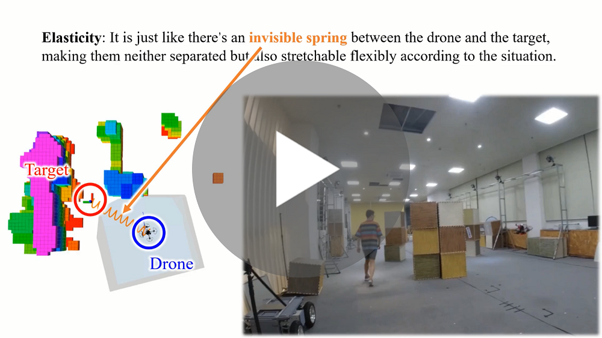
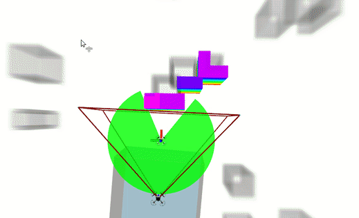
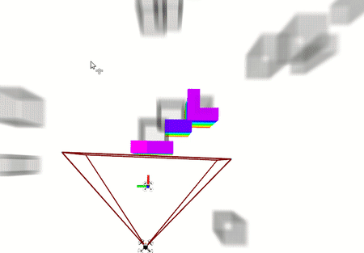
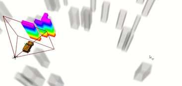

# Elastic-Tracker

## 0. Overview
**Elastic-Tracker** is a flexible trajectory planning framework that can deal with challenging tracking tasks with guaranteed safety and visibility.

**Authors**: Jialin Ji, Neng Pan and [Fei Gao](https://ustfei.com/) from the [ZJU Fast Lab](http://zju-fast.com/). 

**Paper**: [Elastic Tracker: A Spatio-temporal Trajectory Planner Flexible Aerial Tracking](https://arxiv.org/abs/2109.07111), Jialin Ji, Neng Pan, Chao Xu, Fei Gao, Accepted in IEEE International Conference on Robotics and Automation (__ICRA 2022__).

**Video Links**: [youtube](https://www.youtube.com/watch?v=G5taHOpAZj8) or [bilibili](https://www.bilibili.com/video/BV1o44y1b7wC)
<a href="https://www.youtube.com/watch?v=G5taHOpAZj8" target="blank">
  <p align="center">
    
  </p>
</a>

## 1. Simulation of Aerial Tracking 

[NOTE] remember to change the CUDA option of **src/uav_simulator/local_sensing/CMakeLists.txt**

>Preparation and visualization:
```
git clone https://github.com/ZJU-FAST-Lab/Elastic-Tracker.git
cd Elastic-Tracker
catkin_make
source devel/setup.zsh
chmod +x sh_utils/pub_triger.sh
roslaunch mapping rviz_sim.launch
```

>A small drone with the global map as the chasing target:
```
roslaunch planning fake_target.launch
```

>Start the elastic tracker:
```
roslaunch planning simulation1.launch
```

>Triger the drone to track the target:
```
./sh_utils/pub_triger.sh
```
<p align="center">
    
</p>

Comparision of the planners *with*  and *without*  **visibility guarantee**:
```
roslaunch planning simulation2.launch
```
<p align="center">
    
</p>

## 2. Simulation of Aerial Landing

> First start the stage of tracking:
```
roslaunch planning fake_car_target.launch
roslaunch planning simulation_landing.launch
./sh_utils/pub_triger.sh
```
> Triger the drone to land on the moving vehicle:
```
./sh_utils/land_triger.sh
```
<p align="center">
    
</p>

## 3. Acknowledgement
We use [**MINCO**](https://github.com/ZJU-FAST-Lab/GCOPTER) as our trajectory representation.

We use [**DecompROS**](https://github.com/sikang/DecompROS) for safe flight corridor generation and visualization.